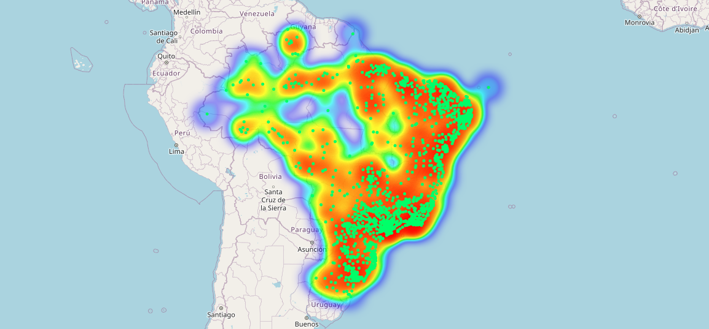
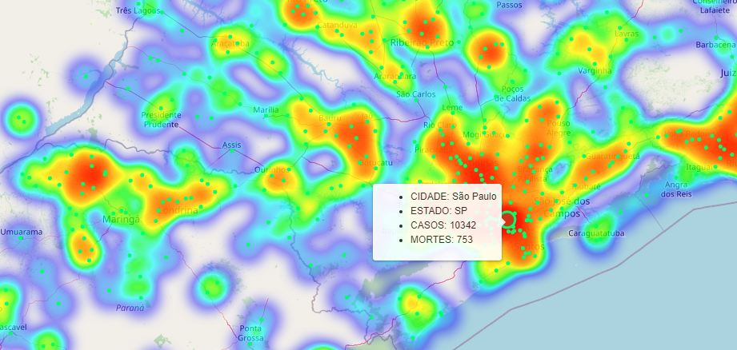

# MAPA DE CALOR COVID19  
Mapa de calor para visualizar a distribuição de casos do COVID19 por municípios.  

**Linguagem utilizada: Python 3 (v3.7.3)**  

### PACOTES UTILIZADOS  

- Pandas  
- Folium  

### OBSERVAÇÕES  

- Visualiza as ocorrências dos casos registrados em distribuição de calor;  
- Mostra as informações (estado, cidade, casos confirmados e mortes);  
- Várias opções de mapa de visualização. Se faz necessário alterar as opções de mapa no código.  

### MAPA  

  
  

